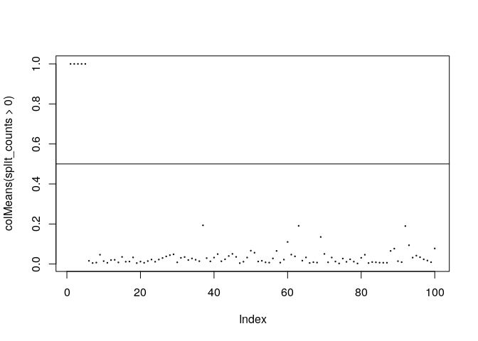

README
================

dartMachine
===========

This is a fork of the bartMachine package with details listed below, designed for use in high-dimensional, sparse, settings. Of course, any bugs here are my own. For details, see [Linero (2016). Bayesian Regression Trees for High Dimensional Prediction and Variable Selection. Journal of the American Statistical Association. To appear](http://www.tandfonline.com/doi/full/10.1080/01621459.2016.1264957).

Instructions
============

For detailed instructions on installation, see the instructions on the [bartMachine](https://github.com/kapelner/bartMachine/) repository. This package is not available on CRAN, and must be installed by compiling from the source.

Illustration
============

The following illustration reproduces some components of Figure 4 from Linero (2016).

``` r
options(java.parameters = "-Xmx2g")
library(dartMachine)
    
Fried <- function(X) {
  10 * sin(pi * X[, 1] * X[,2]) + 20 * (X[,3] - 0.5)^2 + 10 * X[,4] + 5 * X[,5]
}
    
FriedSamp <- function(n, dim_x, sigma=1) {
  X <- matrix(runif(n * dim_x), n, dim_x)
  mu <- Fried(X)
  Y <- rnorm(n, mu, sigma)
    
  return(list(X=X, Y=Y))
}
    
RMSE <- function(x,y) sqrt(mean((x - y)^2))
    
set.seed(123)
train <- FriedSamp(250, 100, sqrt(10))
test  <- FriedSamp(1000, 100, sqrt(10))
    
## Fit bart
bart      <- bartMachine(X = as.data.frame(train$X), y = train$Y, seed = 1234, num_trees = 200)
```

    ## bartMachine initializing with 200 trees...
    ## Now building bartMachine for regression ...Covariate importance prior ON. 
    ## evaluating in sample data...done

``` r
bart_pred <- predict(bart, as.data.frame(test$X))
rm(bart); gc()
```

    ##           used (Mb) gc trigger  (Mb) max used  (Mb)
    ## Ncells 1493286 79.8    2637877 140.9  2637877 140.9
    ## Vcells 1660559 12.7   13674948 104.4 14020790 107.0

``` r
## Fit dart, with alpha = 1
dart   <- bartMachine(X = as.data.frame(train$X), y = train$Y,
                      do_ard = TRUE,
                      num_trees = 200,
                      num_burn_in = 5000, 
                          num_iterations_after_burn_in = 5000,
                      alpha_0 = 1, 
                            seed = 1234)
```

    ## bartMachine initializing with 200 trees...
    ## Now building bartMachine for regression ...Covariate importance prior ON. 
    ## evaluating in sample data...done

``` r
dart_pred    <- predict(dart, as.data.frame(test$X))
split_counts <- get_var_counts_over_chain(dart, type = "splits")
s_samples    <- get_cov_prior_select(dart)
rm(dart); gc()
```

    ##           used (Mb) gc trigger  (Mb) max used  (Mb)
    ## Ncells 1530046 81.8    2637877 140.9  2637877 140.9
    ## Vcells 2477540 19.0   13257030 101.2 17037812 130.0

``` r
## RMSE
RMSE(bart_pred, Fried(test$X))
```

    ## [1] 2.76089

``` r
RMSE(dart_pred, Fried(test$X))
```

    ## [1] 1.422885

``` r
## Reproduction of figure in paper
plot(colMeans(split_counts > 0), cex=.2)
abline(h = 0.5)
```



``` r
plot(colMeans(s_samples))
```


